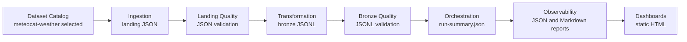

# Current Local Flow

The current local data flow demonstrates a full vertical slice from dataset selection to visualization.

## Mermaid Diagram

## Local Artifact Types

The flow produces the following artifact types:

- **Landing**: `JSON`
- **Bronze**: `JSONL`
- **Observability**: `JSON` and `Markdown` reports
- **Dashboards**: static `HTML`

Note: Apache Parquet is currently being evaluated for future implementation but is not part of the current local MVP flow.
