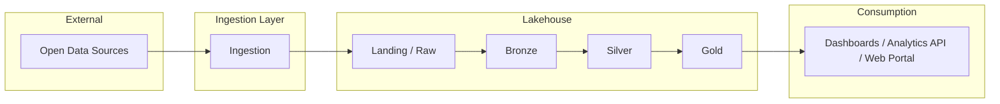

# Data Flow

The following diagram illustrates the data flow through the Open Data Lakehouse Lab.

```mermaid
graph LR
    subgraph "External"
        S[Open Data Sources]
    end

    subgraph "Ingestion Layer"
        I[Ingestion]
    end

    subgraph "Lakehouse"
        L[Landing / Raw]
        B[Bronze]
        Si[Silver]
        G[Gold]
    end

    subgraph "Consumption"
        A[Dashboards / Analytics API / Web Portal]
    end

    S --> I
    I --> L
    L --> B
    B --> Si
    Si --> G
    G --> A
```
